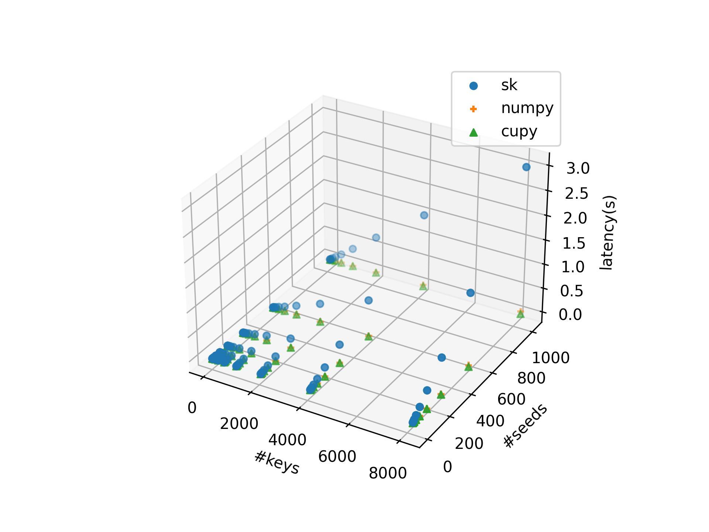
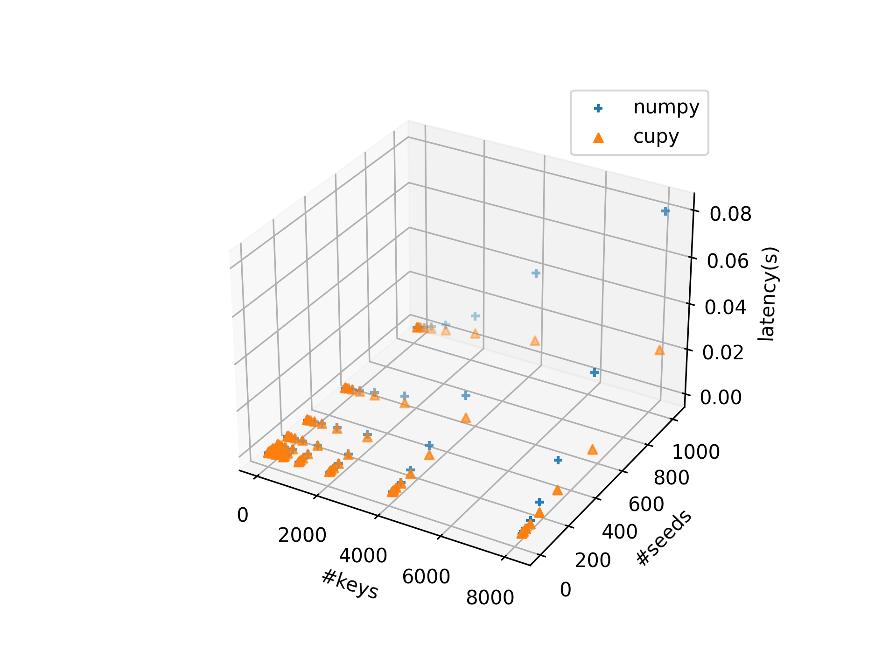

### What is This
Python implementation of Murmurhash3 based on numpy/cupy that utilizes the multi-core power of CPU/GPU to accelerate the hashing of multiple keys/seeds. This implementation is useful when:
* Your application needs Murmurhash3 to hash multiple keys with multiple seeds at once (as Python multi-threading is inefficient).
* You want to utilize the parallel power of GPU.
* You don't want to make your project complex by wrapping C/CUDA code.

Inspired by the implementation of [MurmurHash3](https://github.com/aappleby/smhasher/blob/master/src/MurmurHash3.cpp), we find most operations are bit-wise operation or element-wise integer addition/multiplication. So numpy/cupy interface is sufficient.

### How to Use
See the docstring of `mmh3.murmurhash3_32`.

### Limitation
* Only `MurmurHash3_x86_32` is implemented. And it does not process the tail, so keys are processable only when the length is the multiplier of 4.
* Now the only unavoidably inefficient part is the for loop at `mmh3.py:88`. So this implementation is slow when the key is long.
* Benchmarking of the implementations with varying key length is to be done.

### Test
We compare the results with the Python interface provided by [scikit-learn](https://scikit-learn.org/stable/modules/generated/sklearn.utils.murmurhash3_32.html), which wraps [MurmurHash3](https://github.com/aappleby/smhasher/blob/master/src/MurmurHash3.cpp), to ensure the correctness of our implementation. See `test.py`.

### Benchmarking
We compare the latency of:
* scikit-learn interface of murmurhash3_32, called in for-loops (labeled as `sk` in the plot below).
* Our implementation with numpy (`numpy`).
* Our implementation with cupy (`cupy`).

with varying number of keys and seeds. CPU: Intel i5-12400 x 6, GPU: NVidia 3060 x 1. See `benchmark.py`.

From the graph above, we can find our implementation is significantly faster with large number of keys and seed. To see the performance comparison of numpy and cupy more clearly, `sk` is omitted in the graph below:

